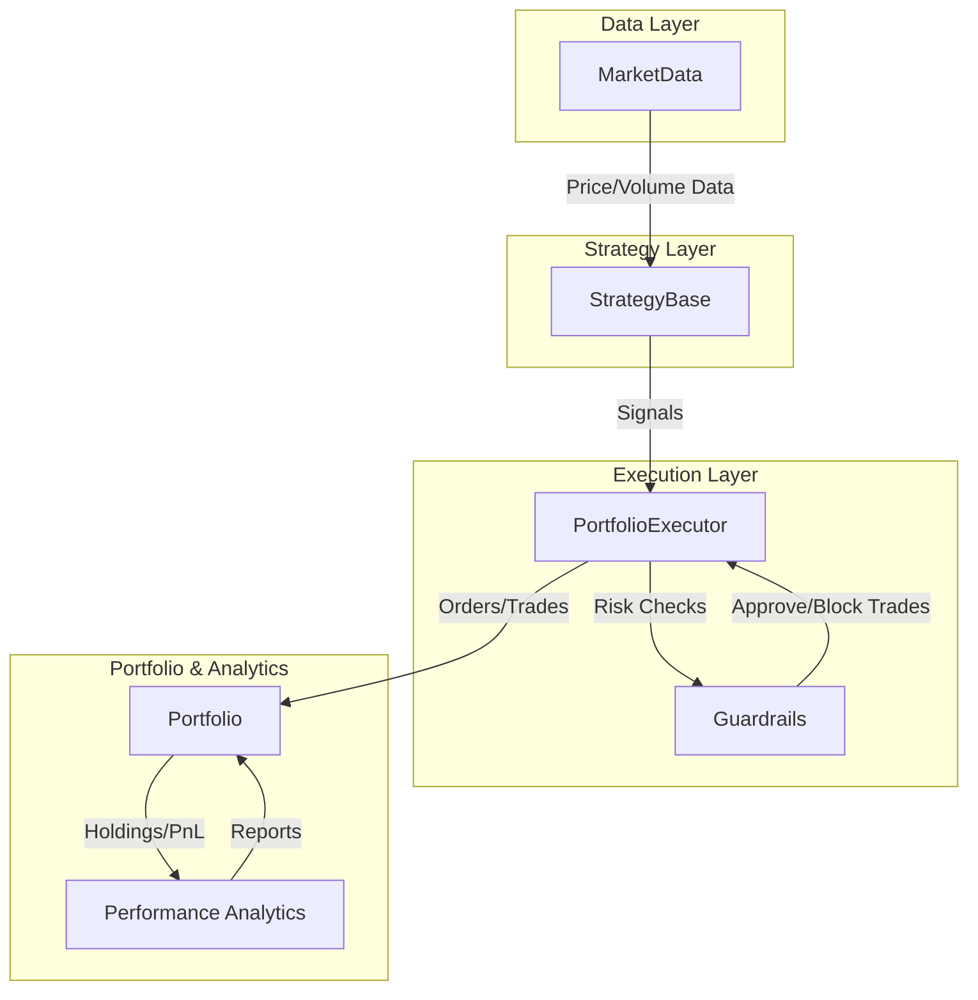

> **Unleash the power of modular, realistic, and extensible portfolio simulation.**

---

## ✨ Why Trader++? 

Trader++ isn’t just another backtesting tool. It’s a full-fledged quant trading engine built for:
- **True Portfolio Simulation:** Manage multiple assets, cash, and trades as real portfolios—not just isolated strategies.
- **Plug-and-Play Modularity:** Swap in new strategies, data sources, or risk guardrails with minimal code.
- **Event-Driven Realism:** Simulate trades, slippage, and portfolio changes in a way that mimics real markets.
- **Powerful Guardrails:** Risk management hooks that go beyond stop-losses—unregister assets, enforce capital limits, and more.
- **Transparent & Hackable:** Built for experimentation, learning, and research. Every core component is swappable and inspectable.

**How is it different from Backtrader, Zipline, or QuantConnect?**
- 🧩 **Cleaner separation of concerns:** Market data, strategies, execution, and portfolio logic are fully decoupled.
- 🛡️ **Advanced guardrails:** Custom risk modules, not just basic stop-losses.
- 💡 **Portfolio as a first-class citizen:** Track capital, trades, and metadata in one place.
- 🧪 **Designed for research:** Easy to debug, extend, and run controlled experiments.
- 🌱 **Open, modern, and Pythonic:** No black boxes, no vendor lock-in, and ready for your next big idea.

---

## 🏆 MVP Roadmap

### 1. Unified Execution Engine
- Common interface: `BacktestExecutor`, `PaperExecutor`, `LiveExecutor`
- Live broker integration (Alpaca, IBKR, TD Ameritrade)
- Real-time slippage, partial fills, latency simulation

### 2. Advanced Strategy Framework
- YAML/DSL config loader for no-code strategies
- Multi-frequency, multi-asset support
- ML model integration (Torch/Sklearn) + MLFlow/W&B logging

### 3. Modular Risk & Portfolio Control
- Position sizing (Kelly, risk parity, volatility targeting)
- Real-time rule engine (e.g., freeze strategy on drawdown)
- Hierarchical/nested portfolios with capital/risk constraints

### 4. Performance & Attribution Analytics
- Alpha, beta, Sharpe, Sortino, Calmar
- Attribution by asset, sector, strategy
- Trade replay and audit trail

### 5. Interactive Visualization
- Streamlit/Dash hybrid dashboard
- Trade timeline, rolling metrics, slippage/turnover/holding histograms

### 6. Scalable Simulation Engine
- Multiprocessed/multithreaded backtesting core
- GPU acceleration for ML strategies
- Clean, event-driven simulation loop

### 7. Data Layer
- SQL/Parquet backend support
- Live feed adapters
- Flexible bar aggregators (time, volume, event)

### 8. AI & Data-Driven Research
- Sentiment and alt-data adapters (Reddit, news, Google Trends)
- Cointegration, Kalman filter, auto-correlation modules

### 9. Tests, Docs, Demos
- Unit tests for each module
- Example strategies (momentum, mean-reversion, breakout)
- Jupyter/Streamlit demo notebooks

---

## 🧠 Objective

Empower quants and developers to:
- Cleanly separate market data, strategies, execution logic, and portfolio tracking
- Run realistic, event-driven backtests and simulations
- Plug-and-play both single-asset and multi-asset strategies

Built for robust experimentation and real-world readiness, with proper portfolio management and capital accounting.

---

## 🗺️ System Architecture



---

## 🔧 Core Components

| Module            | Purpose                                                                 |
|-------------------|-------------------------------------------------------------------------|
| Portfolio         | Tracks assets, cash, trades, and strategy metadata. Self-contained unit. |
| PortfolioExecutor | Orchestrates strategy execution, manages trade logic, evaluates guards.  |
| MarketData        | Historical price data & sliding window views for strategies.             |
| StrategyBase      | Interface for strategy design, single/multi-asset support.               |
| Backtester        | Runs simulations, exports performance reports and logs.                  |

---

## 💡 Main Features

- 📈 **Backtesting Engine** — Realistic execution, guardrails, cash balance checks
- 🧠 **Pluggable Strategy Interface** — Stateful/stateless signal generation
- 💼 **Portfolio Tracking** — Accurate PnL with trade logs, equity curves
- 🛡️ **Guardrail System** — Risk management hooks (stop-loss, asset unregister)
- 📊 **Performance Reporting** — Sharpe, max drawdown, win rate, CAGR, more
- 🔬 **Benchmark Comparison** — Alpha, beta, vs SPY or other tickers
- 🧪 **Test Strategies** — Debug pipeline (e.g., “buy once on day 1”)

---

## 🚀 Quick Start

```sh
# Install dependencies
pip install -r requirements.txt

# Run a backtest
python run_backtest.py --strategy momentum --tickers AAPL,MSFT --start 2023-01-01 --end 2023-12-31 --plot

# Or use the Streamlit UI
streamlit run streamlit_app.py
```

---

## 🧩 Project Structure

```text
📦traderplusplus
├── contracts
│   ├── asset.py           # Asset & CashAsset classes
│   └── portfolio.py       # Portfolio definition
├── core
│   ├── backtester.py      # Runs simulation
│   ├── executor.py        # Executes trades
│   ├── market_data.py     # Loads, stores & queries market data
│   ├── data_loader.py     # Yahoo/Polygon loaders + caching
│   ├── guardrails         # Risk guardrail classes
│   └── visualizer.py      # Matplotlib + Plotly charts
├── strategies
│   ├── base.py            # StrategyBase + factory
│   └── stock
│       ├── momentum.py    # Example strategy
├── analytics
│   └── performance.py     # Sharpe, Alpha etc.
├── run_backtest.py        # CLI tool
└── streamlit_app.py       # UI
```

---

## 🌱 Vision for Future Work

See the MVP Roadmap above for our ambitious next steps!

---

## 🙌 Contributing

Pull requests and suggestions are welcome! For major changes, please open an issue first to discuss what you’d like to change.

---

## 📄 License

Distributed under the MIT License.

---

## 📬 Contact

Open an issue or reach out via GitHub for questions and collaboration!

---

Enjoy building and experimenting with Trader++! 🚀