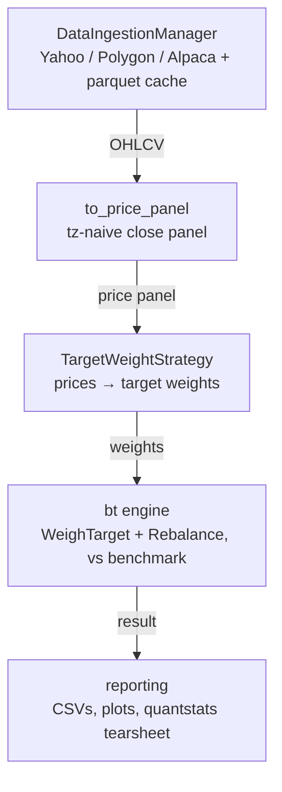

<p align="center">
  
</p>

> 💡 Why Trader++?
>
> I built Trader++ because I wanted a tool that didn’t lie to me.
>
> I needed something that could:
> - Let me write strategies quickly
> - Simulate realistically
> - Go from backtest → paper → live with zero rewrites
> - Show me how my portfolio’s actually doing, holistically!
>
> Existing tools? Clunky. Proprietary. Not programmable enough.
>
> So I built it — for myself first. Now, it’s for every quant who thinks like a developer.
>
> **Unleash the power of modular, realistic, and extensible portfolio simulation.**

---

## ✨ Why Trader++? 

Trader++ isn’t just another backtesting tool. It’s a full-fledged quant trading engine built for:
- **True Portfolio Simulation:** Manage multiple assets, cash, and trades as real portfolios—not just isolated strategies.
- **Plug-and-Play Modularity:** Swap in new strategies, data sources, or risk guardrails with minimal code.
- **Event-Driven Realism:** Simulate trades, slippage, and portfolio changes in a way that mimics real markets.
- **Powerful Guardrails:** Risk management hooks that go beyond stop-losses—unregister assets, enforce capital limits, and more.
- **Transparent & Hackable:** Built for experimentation, learning, and research. Every core component is swappable and inspectable.

**How is it different from Backtrader, Zipline, or QuantConnect?**
- 🧩 **Cleaner separation of concerns:** Market data, strategies, execution, and portfolio logic are fully decoupled.
- 🛡️ **Advanced guardrails:** Custom risk modules, not just basic stop-losses.
- 💡 **Portfolio as a first-class citizen:** Track capital, trades, and metadata in one place.
- 🧪 **Designed for research:** Easy to debug, extend, and run controlled experiments.
- 🌱 **Open, modern, and Pythonic:** No black boxes, no vendor lock-in, and ready for your next big idea.

---

## 🏆 MVP Roadmap

### 1. From backtest to paper/live
- Backtests run on `bt`; the same target-weight strategies drive trading
- Automated paper trading: recompute weights on a schedule → diff holdings → orders via a thin broker port
- Broker-agnostic (Alpaca paper first, IBKR swappable), then live paper

### 2. Advanced Strategy Framework
- YAML/DSL config loader for no-code strategies
- Multi-frequency, multi-asset support
- ML model integration (Torch/Sklearn) + MLFlow/W&B logging

### 3. Modular Risk & Portfolio Control
- Position sizing (Kelly, risk parity, volatility targeting)
- Real-time rule engine (e.g., freeze strategy on drawdown)
- Hierarchical/nested portfolios with capital/risk constraints

### 4. Performance & Attribution Analytics
- Alpha, beta, Sharpe, Sortino, Calmar
- Attribution by asset, sector, strategy
- Trade replay and audit trail

### 5. Interactive Visualization
- Streamlit/Dash hybrid dashboard
- Trade timeline, rolling metrics, slippage/turnover/holding histograms

### 6. Scalable Simulation Engine
- Multiprocessed/multithreaded backtesting core
- GPU acceleration for ML strategies
- Clean, event-driven simulation loop

### 7. Data Layer
- SQL/Parquet backend support
- Live feed adapters
- Flexible bar aggregators (time, volume, event)

### 8. AI & Data-Driven Research
- Sentiment and alt-data adapters (Reddit, news, Google Trends)
- Cointegration, Kalman filter, auto-correlation modules

### 9. Tests, Docs, Demos
- Unit tests for each module
- Example strategies (momentum, mean-reversion, breakout)
- Jupyter/Streamlit demo notebooks

---

## 🚦 MVP Status (June 2025)

| Feature                           | Status      | Notes                                                                                                          |
|-----------------------------------|-------------|----------------------------------------------------------------------------------------------------------------|
| Unified Execution Engine          | ✅ Complete | Backtest, Paper, Live modes implemented with shared API. Paper & Live mode requires broker API implementation. |
| Modular Strategy Framework        | ✅ Complete | StrategyBase and example strategies present. Plug-and-play.                                                    |
| Portfolio/Risk Management         | ✅ Complete | Portfolio class, guardrails, position sizing hooks implemented.                                                |
| Analytics & Attribution           | ✅ Partial  | Core metrics (Sharpe, alpha, etc.) present. Some advanced analytics in progress.                               |
| Interactive Dashboard             | ⚠️ Partial | Streamlit app exists, some features stubbed or in progress.                                                    |
| Scalable Simulation Engine        | ⚠️ Partial | Event-driven core present; multiprocessing support basic or planned.                                           |
| Data Layer                        | ✅ Complete | Data ingestion, caching, and basic adapters present.                                                           |
| ML/DSL Integration                | 🚧 Planned  | ML model integration and YAML/DSL loader planned.                                                              |

---

## Next Steps (Post-MVP)
- Expand broker integrations for live trading
- Enhance dashboard with more analytics and controls
- Add ML/DSL strategy support
- Improve test coverage and documentation

---

## 🧠 Objective

Empower quants and developers to:
- Cleanly separate market data, strategies, execution logic, and portfolio tracking
- Run realistic, event-driven backtests and simulations
- Plug-and-play both single-asset and multi-asset strategies

Built for robust experimentation and real-world readiness, with proper portfolio management and capital accounting.

---

## 🗺️ System Architecture


```mermaid
flowchart TD
    A[DataIngestionManager<br/>Yahoo / Polygon / Alpaca + parquet cache]
    B[to_price_panel<br/>tz-naive close panel]
    C[TargetWeightStrategy<br/>prices → target weights]
    D[bt engine<br/>WeighTarget + Rebalance, vs benchmark]
    E[reporting<br/>CSVs, plots, quantstats tearsheet]
    A -- OHLCV --> B
    B -- price panel --> C
    C -- weights --> D
    D -- result --> E
```

---

## 🏗️ Project Structure & Architecture

The engine runs on [`bt`](https://pmorissette.github.io/bt/); metrics come from `ffn` + `quantstats`. The
pipeline is **data → price panel → strategy weights → `bt` → reports**. See `docs/00-direction.md` for the
current state and roadmap.

- `data_ingestion/`, `data_cache/` — provider fetchers (Yahoo, Polygon, Alpaca) + parquet cache
- `core/data_loader.py`, `core/price_panel.py` — data ingestion/caching and the `bt` price panel adapter
- `strategies/` — `TargetWeightStrategy` interface + registry (`base.py`), `buy_n_hold.py`, `momentum.py`
- `engine/runner.py` — builds and runs the `bt` backtest (+ benchmark)
- `reporting/report.py` — CSVs, PNG plots, and the quantstats HTML tearsheet
- `run.py` — CLI entry point
- `tests/` — no-look-ahead + smoke tests

---

## 🚦 Development Roadmap (Next Steps)

The single source of truth for current state and roadmap is **`docs/00-direction.md`**. In short, next up:

1. **Multi-ticker rebalancing strategy** — cross-sectional target weights with periodic reconstitution.
2. **Portfolio comparison view** — run several strategies and compare alpha/beta/Sharpe/drawdown/risk.
3. **Automated paper trading** — recompute weights on a schedule → diff holdings → orders via a thin broker
   port (Alpaca paper first), then live paper.

---

## 🔧 Core Components

| Module                  | Purpose                                                                  |
|-------------------------|--------------------------------------------------------------------------|
| `DataIngestionManager`  | Fetches OHLCV from Yahoo/Polygon/Alpaca with a parquet cache.            |
| `to_price_panel`        | Turns per-ticker OHLCV into a tz-naive close-price panel for `bt`.       |
| `TargetWeightStrategy`  | Authoring interface: maps a price panel to target weights (no look-ahead).|
| `engine.runner.run`     | Runs the strategy + benchmark on `bt`.                                    |
| `reporting.write_reports` | Writes CSVs, plots, and the quantstats tearsheet (alpha/beta/Sharpe/risk).|

---

## 💡 Main Features

- 📈 **Backtesting Engine** — Realistic execution, guardrails, cash shares checks
- 🧠 **Pluggable Strategy Interface** — Stateful/stateless signal generation
- 💼 **Portfolio Tracking** — Accurate PnL with trade logs, equity curves
- 🛡️ **GuardrailBase System** — Risk management hooks (stop-loss, asset unregister)
- 📊 **Performance Reporting** — Sharpe, max drawdown, win rate, CAGR, more
- 🔬 **Benchmark Comparison** — Alpha, beta, vs SPY or other tickers
- 🧪 **Test Strategies** — Debug pipeline (e.g., “buy once on day 1”)

---

## 🚀 Quickstart

1. **Install Requirements**
   ```bash
   pip install -r requirements.txt
   ```
2. **Run a Backtest**
   ```bash
   python run.py --strategy=momentum --tickers=AAPL --benchmark=SPY --start=2023-01-01 --end=2024-01-01 --out=output/momentum
   ```
   Reports land in the `--out` directory: `equity_curve.csv`, `daily_returns.csv`, `stats.csv`,
   `metrics.csv`, `equity_vs_benchmark.png`, `drawdown.png`, and `tearsheet.html`.
3. **Add a New Strategy**
   - Add a class in `strategies/` subclassing `TargetWeightStrategy` and implementing
     `weights(prices) -> DataFrame` (target weights per ticker; apply any signal lag inside to avoid look-ahead).
   - Decorate it with `@register("your_name")` and import it from `strategies/__init__.py`.
   - Ship it with a no-look-ahead test in `tests/`.
---

## 🤝 Contributing

[//]: # (- See the Development Roadmap above for high-priority areas.)
- Add new strategies, data adapters, or analytics modules as composable units.
- Follow modular design and document your code.
- PRs and issues welcome!

---

## 🌱 Vision for Future Work

See the MVP Roadmap above for our ambitious next steps!

---

## 📄 License

Distributed under the Apache-2.0 License.

---

## 📬 Contact

Open an issue or reach out at [rohitashwachaks@gmail.com] for questions and collaboration!

---

Enjoy building and experimenting with Trader++! 🚀
