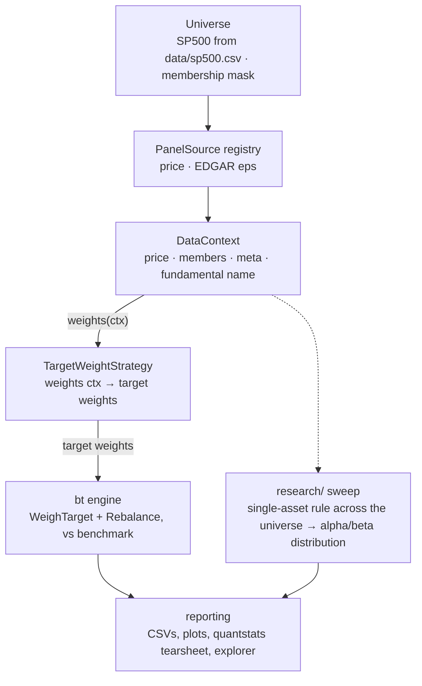

<p align="center">
  
</p>

> 💡 Why Trader++?
>
> I built Trader++ because I wanted a tool that didn’t lie to me.
>
> I needed something that could:
> - Let me write strategies quickly
> - Backtest them *honestly* — no look-ahead, no survivorship, no cherry-picking
> - Go from backtest → paper → live with zero rewrites
> - Show me how my portfolio’s actually doing, holistically!
>
> Existing tools? Clunky. Proprietary. Not programmable enough.
>
> So I built it — for myself. This is a **personal instrument**, not a product: no roadmap
> bends toward customers, monetization, or feature parity with platforms. It bends toward
> one thing — results I can trust with my own money.

---

## ✨ What Trader++ is

A **trustworthy personal research backtester**, evolving toward automated paper trading. **Correctness is the
product** — a fast, pretty, subtly-wrong backtest loses real money. It runs on proven libraries
([`bt`](https://pmorissette.github.io/bt/) for the engine, `ffn` + `quantstats` for metrics) and adds the thing
those libraries don't give you: **discipline against the biases that make backtests lie.**

- **No look-ahead, structurally.** A signal for day *t* uses only data through *t*; every strategy ships a test
  that fails if it peeks.
- **Universe-first, not ticker-first.** A rule is judged across a whole universe (S&P 500), never on one
  hand-picked survivor. Single-name rules are *swept* across the market so you see the **distribution** of
  alpha/beta, not a cherry-pick.
- **Point-in-time fundamentals.** Fundamentals come from SEC EDGAR keyed to each value's **filing date**
  (as-first-filed) — so a P/E strategy is ranked on what was *public* then, not today's snapshot.
- **Biases are labeled, never hidden.** Every report stamps what it still can't promise (e.g. survivorship).
- **Target weights, swappable everything.** Strategies express *target weights*; data sources, guardrails, and
  the broker all sit behind small registries/ports.

Constraints that shape it: daily bars (no intraday/HFT), holds ~1 day–6 months, rebalancing/reconstitution
style. Full rationale and roadmap in **[`docs/00-direction.md`](docs/00-direction.md)** and
**[`docs/03-research-platform.md`](docs/03-research-platform.md)**.

---

## 🗺️ Architecture


```mermaid
flowchart TD
    U[Universe<br/>SP500 from data/sp500.csv · membership mask]
    A[PanelSource registry<br/>price · EDGAR eps]
    B[DataContext<br/>price · members · meta · fundamental name]
    C[TargetWeightStrategy<br/>weights ctx → target weights]
    D[bt engine<br/>WeighTarget + Rebalance, vs benchmark]
    E[reporting<br/>CSVs, plots, quantstats tearsheet, explorer]
    S[research/ sweep<br/>single-asset rule across the universe → alpha/beta distribution]
    U --> A --> B
    B -- weights(ctx) --> C
    C -- target weights --> D --> E
    B -.-> S --> E
```

`data → DataContext → strategy weights → bt → reports`. A strategy reads everything through one `DataContext`
(`ctx.price`, `ctx.members`, `ctx.fundamental("eps")`), so new data sources plug in without touching strategies.

---

## 🧪 Strategies (built-in)

| Name | Kind | Idea |
|------|------|------|
| `buy_n_hold` | basket | Equal-weight all in-universe names (the benchmark baseline). |
| `momentum` | single-asset | SMA crossover, in-or-cash per name. Judge it by *sweeping* the universe. |
| `xs_momentum` | basket | Cross-sectional: hold the top trailing-return names, reconstituted monthly. |
| `dual_momentum` | basket | Rank by short-vs-long *rate* (accelerating momentum). |
| `ls_pe` | basket, long/short | Dollar-neutral: long cheapest P/E, short richest, on point-in-time EDGAR EPS. |
| `sector_neutral_momentum` | basket, cross-industry | Hold the top momentum name in *each* sector/SIC group, so the book spans industries. |

---

## 🚀 Quickstart

```bash
pip install -r requirements.txt
```

```bash
# Backtest a basket strategy over the S&P 500 (paste constituents into data/sp500.csv first)
python run.py --strategy=xs_momentum --universe=sp500 --benchmark=SPY --start=2019-01-01 --end=2024-01-01

# A point-in-time long/short value book (pulls annual EPS from SEC EDGAR)
python run.py --strategy=ls_pe --universe=sp500 --limit=50 --benchmark=SPY --start=2018-01-01 --end=2024-01-01

# Sweep a single-asset rule across the whole universe → alpha/beta distribution
python sweep.py --strategy=momentum --universe=sp500 --benchmark=SPY --start=2019-01-01 --end=2024-01-01
```

Artifacts land in `--out` (default `output/`): `equity_curve.csv`, `daily_returns.csv`, `stats.csv`,
`metrics.csv`, `equity_vs_benchmark.png`, `drawdown.png`, `tearsheet.html`, `equity_explorer.html` (and, for a
sweep, `per_name_metrics.csv` + `alpha_beta_distribution.html`). See
**[`docs/02-getting-started.md`](docs/02-getting-started.md)** for all flags, guardrails, and paper trading.

### Add a strategy

```python
# strategies/my_strategy.py
import pandas as pd
from core.context import DataContext
from strategies.base import TargetWeightStrategy, register

@register("my_strategy")
class MyStrategy(TargetWeightStrategy):
    name = "my_strategy"
    requires = ()                       # extra context panels, e.g. ("eps",)

    def weights(self, ctx: DataContext) -> pd.DataFrame:
        prices = ctx.price.where(ctx.members)            # only hold in-universe names
        signal = (prices > prices.rolling(50).mean()).astype(float)
        w = signal.div(signal.sum(axis=1).where(lambda s: s > 0), axis=0).fillna(0.0)
        return w.shift(1).fillna(0.0)                    # decide t, act t+1 — no look-ahead
```

Import it in `strategies/__init__.py` and **ship a no-look-ahead test** in `tests/` (truncating the future must
not change a past weight). That test is the credibility gate — see `AGENT.md`.

---

## 🏗️ Project structure

```text
data_ingestion/   provider fetchers (yahoo, polygon, alpaca) + edgar_fetcher.py (SEC XBRL: concepts,
                  full 10-K/10-Q company facts, submissions/SIC — all keyed to filed dates)
core/             store (canonical additive price store) · data_loader (legacy intraday cache) ·
                  price_panel · sources (PanelSource registry) · context (DataContext) ·
                  universe (SP500, membership) · fundamentals (PIT EPS/TTM/shares/SIC)
data/sp500.csv    pasted S&P 500 constituents incl. CIK (committed input)
strategies/       base (registry, weights(ctx), attachable guardrails) + buy_n_hold · momentum ·
                  xs_momentum · dual_momentum · ls_pe
guardrails/       base (registry) + stop_loss — risk overlays on weights
engine/           runner (bt backtest + costs + benchmark) · frequency · paper (plan + reconcile) · journal
research/         sweep (single-asset across a universe) + report (alpha/beta distribution)
reporting/        report (stamped CSVs, PNGs, tearsheet) · interactive (equity explorer) · manifest
brokers/          base (Broker port) · alpaca (paper, REST)
run.py            backtest CLI      sweep.py  universe-sweep CLI      paper_trade.py  paper-rebalance CLI
tests/            no-look-ahead + golden-file + store + costs + EDGAR PIT + journal/reconcile + more
```

---

## 🚦 Status

| Area | Status | Notes |
|------|--------|-------|
| Engine on `bt` + metrics | ✅ | Rebalancing backtests; `ffn`/`quantstats` own Sharpe/alpha/beta/drawdown. |
| Trust rails | ✅ | Run manifest + bias stamps in every artifact, golden-file test, CI, data-quality checks. |
| Canonical price store | ✅ | Additive per-ticker parquet + gap-only fetching (`core/store.py`); re-runs download nothing. |
| Trading costs | ✅ | `--cost-bps` commission/slippage hook + turnover report; `0` (default) is stamped frictionless. |
| Strategy framework | ✅ | `TargetWeightStrategy` registry, `weights(ctx)`, attachable guardrails, 5 built-in strategies. |
| Pluggable data layer | ✅ | `PanelSource` registry, `DataContext`, SP500 universe + membership mask. |
| Point-in-time fundamentals | ✅ | EDGAR as-first-filed: annual + TTM EPS, shares (→ market cap), SIC, full 10-K/10-Q facts ingest. |
| Universe sweep + distribution | ✅ | Per-name alpha/beta across a universe; interactive chart. |
| Guardrails / risk | ◑ | Stop-loss done, strategy-attached; vol targeting / position caps planned. |
| Paper trading | ◑ | Alpaca paper rebalance + order journal + fill reconciliation (`--reconcile`); drift monitor pending. |
| Survivorship-free universe | ✗ | Universe is today's members (labeled biased). Blocked on a delisted-inclusive data source (roadmap M4). |
| Live paper / monitoring | ✗ | Future phase (roadmap M7). |

Planned work, ideas, and open decisions live in **[`docs/04-backlog.md`](docs/04-backlog.md)**.

---

## 📄 License

Distributed under the Apache-2.0 License.

## 📬 Contact

Open an issue or reach out at rohitashwachaks@gmail.com for questions and collaboration.
