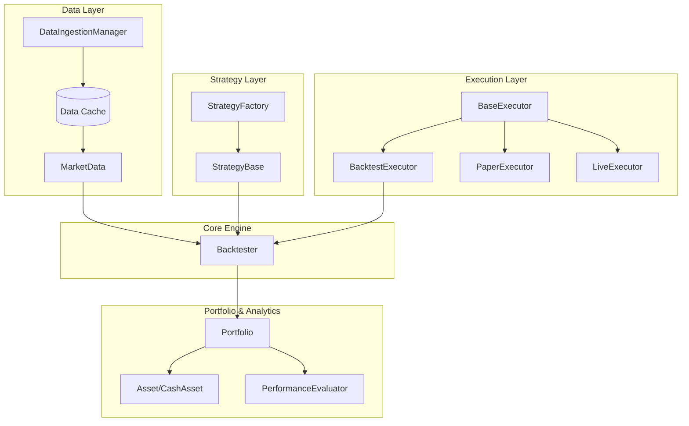

# Overview & Architecture

## 🎯 What is Trader++?

Trader++ is a **modular, realistic, and extensible trading engine** designed for quantitative researchers, algorithmic traders, and developers who need a transparent, hackable platform for:

- **Strategy Development**: Rapid prototyping of trading strategies with clean abstractions
- **Realistic Backtesting**: Event-driven simulation that mimics real market conditions
- **Portfolio Management**: True multi-asset portfolio tracking with proper capital accounting
- **Risk Management**: Advanced guardrail systems beyond basic stop-losses
- **Seamless Deployment**: Go from backtest → paper → live with zero code rewrites

## 🏗️ Core Design Principles

### 1. Separation of Concerns
Trader++ cleanly separates four fundamental concerns:
- **Data Layer**: Market data ingestion, caching, and access
- **Strategy Layer**: Signal generation logic
- **Execution Layer**: Order routing and fill simulation
- **Portfolio Layer**: Position tracking and capital management

### 2. Portfolio as First-Class Citizen
Unlike many backtesting frameworks that treat strategies in isolation, Trader++ manages portfolios holistically:
- Track multiple assets simultaneously
- Accurate cash accounting
- Trade history and audit trails
- Benchmark comparison built-in

### 3. Plug-and-Play Modularity
Every component is swappable:
- Strategies via `StrategyBase` interface
- Executors via `BaseExecutor` interface
- Guardrails via `GuardrailBase` interface
- Data sources via `DataIngestionManager`

### 4. Event-Driven Realism
The backtesting engine simulates market events chronologically:
- No look-ahead bias
- Realistic order execution
- Proper time-series handling
- Slippage and latency simulation (in paper/live modes)

## 🗺️ System Architecture



## 📦 Module Organization

```
traderplusplus/
├── contracts/          # Core data models
├── core/              # Core engine
├── strategies/        # Trading strategies
├── executors/         # Execution engines
├── guardrails/        # Risk management
├── data_ingestion/    # Data sources
├── analytics/         # Performance evaluation
├── brokers/           # Broker integrations
└── utils/             # Utilities
```

## 🆚 Comparison with Other Frameworks

| Feature | Trader++ | Backtrader | Zipline | QuantConnect |
|---------|----------|------------|---------|--------------|
| **Modularity** | ✅ Fully decoupled | ⚠️ Tightly coupled | ⚠️ Moderate | ❌ Proprietary |
| **Portfolio-First** | ✅ Yes | ❌ Strategy-centric | ✅ Yes | ✅ Yes |
| **Custom Guardrails** | ✅ Full support | ⚠️ Limited | ❌ No | ⚠️ Limited |
| **Backtest→Live** | ✅ Same code | ❌ Different APIs | ❌ Separate systems | ✅ Yes |
| **Open Source** | ✅ Apache-2.0 | ✅ GPL-3.0 | ✅ Apache-2.0 | ❌ Closed |

## 📚 Next Steps

- **New to Trader++?** → [Getting Started Guide](./02-getting-started.md)
- **Building Strategies?** → [Strategy Development](./05-strategies.md)
- **Deep Dive?** → [Core Components](./03-core-components.md)

---

**Related Documentation**:
- [Getting Started](./02-getting-started.md)
- [Core Components](./03-core-components.md)
- [Examples & Tutorials](./12-examples.md)
